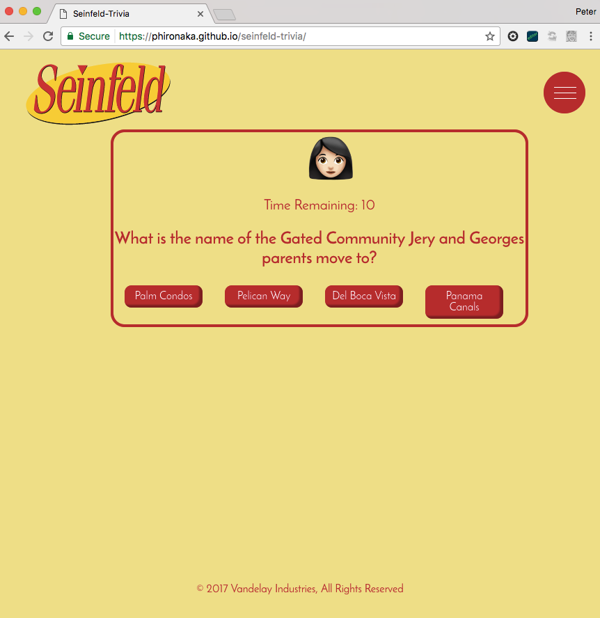

# Seinfeld Trivia!

## Link To Game

### [Seinfeld Trivia](https://phironaka.github.io/seinfeld-trivia/)

## Premise

Seinfeld Trivia! is a two player trivia game to test a user's knowledge of Seinfeld. 

## Requirements
- Needs to be two player
- Must have some knowledge of the popular TV series Seinfeld

## User Story

- Once the player loads the site, they have the option to play a two player game or one player game 
- For each given question: if you provide the correct answer, a 'ding' noise animates in the background
- For each correct answer, a 'giddyup!' message gets displayed signifying it was correct
- For each in correct answer, a red 'wrong' gets printed
- Once a user submits their answer, they will have the option to jump to the next question
- There is a an info icon in the upper right hand corner. If a user clicks this button, a pop up screen will appear displaying the rules of the game.
- Once player 1 completes the series questions, a score card will appear on the screen detailing how many questions they got correct and incorrect
- Once player 1 finishes and receives his score, it will then prompt user 2 to begin his game
- Once player two completes the series of questions, an outcome of scores will be determined.
- If a player does not provide an answer within a ten second window, the player will be given an incorrect score.
- Within 5 seconds of the time ending, the user will see flashing red lights appear on the screen as a reminder
- If player 1 wins, they will receive a congratulations message w/GIF and alert message
- If player 2 wins, they will receive a congratulations message w/GIF and alert message of their own
- If there is a tie, then in the spirit of Seinfeld, We're all Winners!
- Once the game is completed, there will be a button on the screen to drive users back to the beginning of the game, where they can start the same process over.

## Minimum Viable Product
- Players are able to test their Seinfeld knowledge in a fun, interactive way
- It logs each person's score
- Hosted on Github Pages
- Switches scores between each player
- Congratulations Screen to the player who wins, whether it's player 1 or player 2
- If there is a tie, there should be a response screen displayed with a message tied to the outcome.
- Some mechanism to drive users back to the beginning of the game.

## Unsolved Problems/ To-dos

- Still having difficulty w/resetting the quiz content after the first game has been completed between both players. For now, I have location.reload() in as placeholder.
- There are currently only eight questions being cycled through. For more of a challenge, I would like to create a larger list of questions to pull from, and from there shuffle those questions so its randomized.
-  SASS framework for more rapid prototyping
- Use BEM (Block Element ) for naming convention purposes
- More use of animation (Jquery, CSS3, SVG)
- Explore Seinfeld's VC a bit further to give it a more cohesive and completed appearance

## Technology
- HTML
- CSS,
- Javascript & jQuery
-  Google Web Font:  Josephin Sans

## CSS Classes and Ids

- ` game ` - All elements of the game sit within this variable
- `player1` - Player 1 
- `#nav` -modal navigation window. all the instructions on how to play the game.
- `.container` - container which wraps around the entire page. 
<<<<<<< HEAD
-  `.container-logo` -  Seinfeld logo
-   `.hamburger-icon` - nav icon in top right hand corner of page
-    `.welcome` -  Intro copy on the home screen
-     `.startButton` - Button on the home screen to start the game
 - `.quiz-content` - div that contains all elements of the game itself (questions, answers, choices)
-  `.score` - the container where the player's marker is at
-   `.score-player` - the h4 tag where the player marker sits
-  `.timer` - Countdown timer
- `.question` - the trivia question
- `.tie` - If there is a tie, a message  and image will appear inside here
-  `.winner` - the winner of the game will have a personalized congratulations message, whether it be player 1 or player 2
-  `.row` -      container where the correct answer's image appears
-   `.info` - parent element of correct answer's image
-    `.choice` - 4 choices for each question asked
=======
- `.container-logo` -  Seinfeld logo
- `.hamburger-icon` - nav icon in top right hand corner of page
- `.welcome` -  Intro copy on the home screen
- `.startButton` - Button on the home screen to start the game
- `.quiz-content` - div that contains all elements of the game itself (questions, answers, choices)
- `.score` - the container where the player's marker is at
- `.score-player` - the h4 tag where the player marker sits
- `.timer` - Countdown timer
- `.question` - the trivia question
- `.tie` - If there is a tie, a message  and image will appear inside here
- `.winner` - the winner of the game will have a personalized congratulations message, whether it be player 1 or player 2
- `.row` -      container where the correct answer's image appears
- `.info` - parent element of correct answer's image
- `.choice` - 4 choices for each question asked
